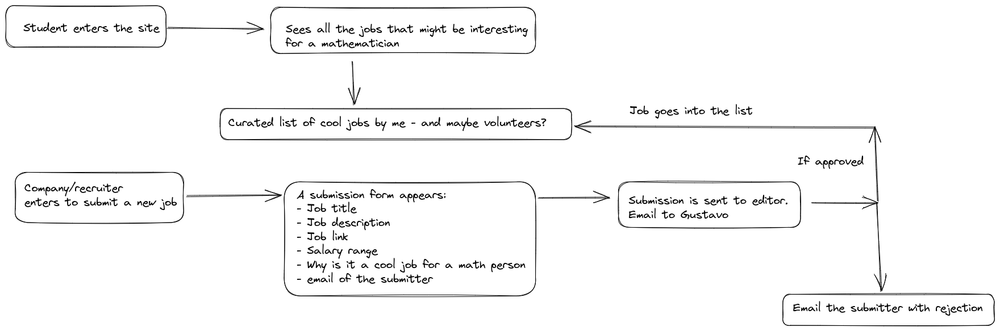

## Welcome to the repo for Cool Math Jobs! 

This site is for mathematicians to find cool jobs, where the definition of cool 
is more or less for a job that would be estimulating for a mathematical mind.

This could be some great Data Science, or perhaps some Aerodynamics, but it can be 
anything that has interesting mathematics in it. 

On the other hand, this site can help you find a mathematician if that is what you 
need to fill a given role. 

The rules as to what is a "cool math job" are rather arbitrary and decided by me, 
the editor, so don't be upset if a submission is not accepted. I can smell boring
jobs, so I'll use that to filter heavily. 

The goal is to help students find cool jobs, so me and the other editors 
will be ruthless! 

## User flow diagram

